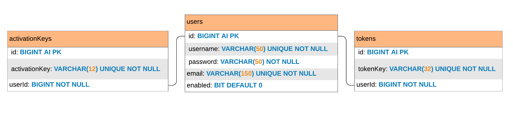
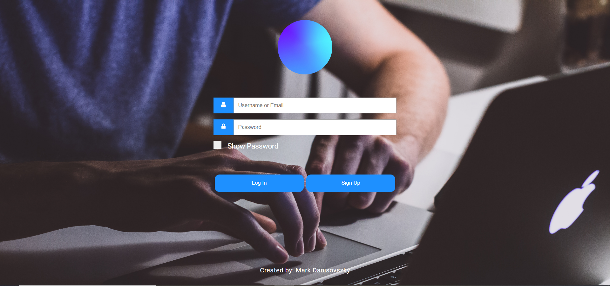
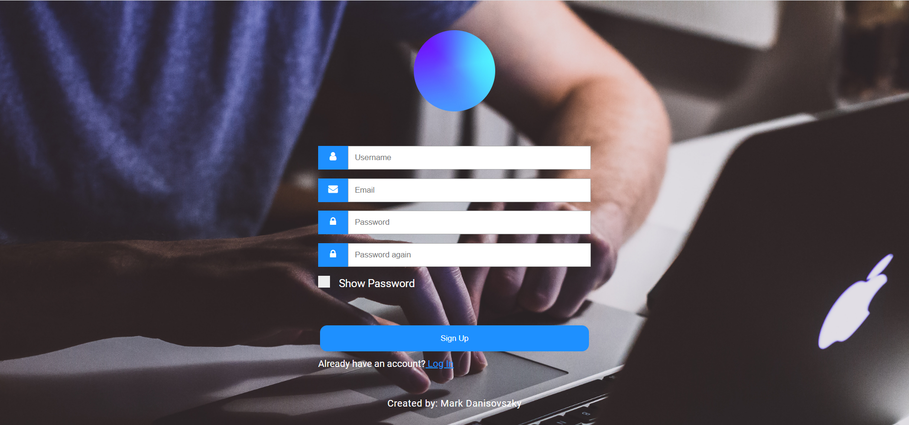
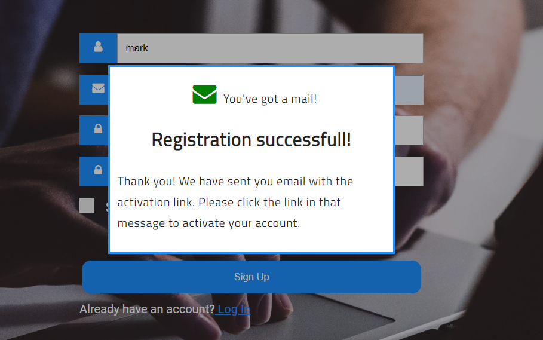
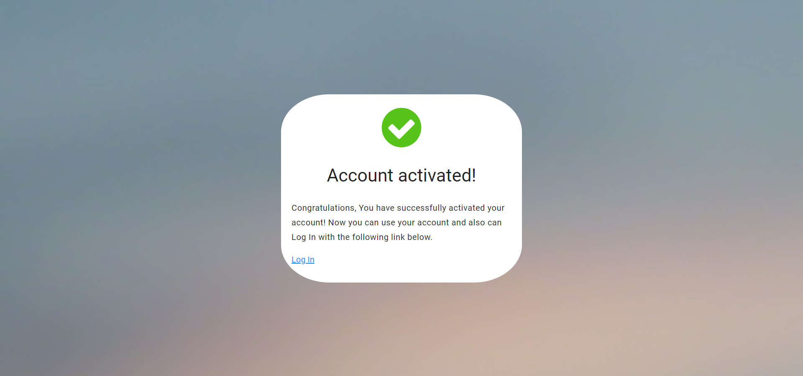
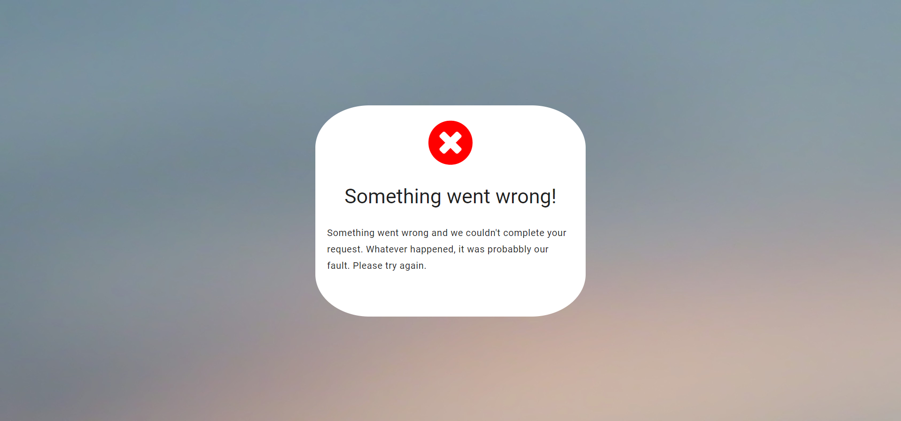
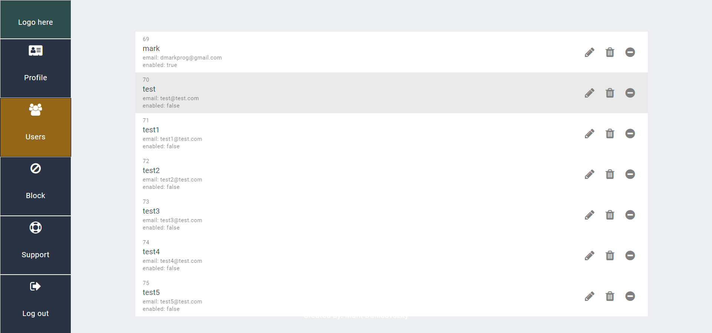
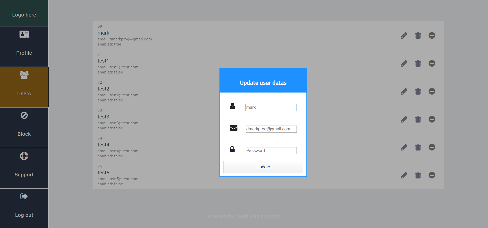
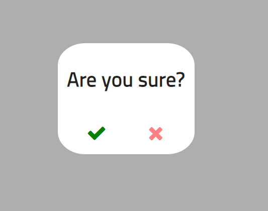

# Web-rest

Ebben a repositrotyban nyomonkövethető egy web alapú REST alkalmazás lefejlesztése melyben token alapú authentikációt valósítok meg. A szolgáltatások, melyeket meg kell valósítanom:

- Bejelentkezés

- Kiléptetés

- Userek listázása

- CRUD műveletek

- Userek tárolása adatbázisban

- Néhány szolgáltatást csak bejelentkezés után lehessen elérni

# Használt technológiák

Backend - Thorntail / maven

Fronted - Angular

Database - MySql

A backend és frontend JSON-t használva kommunikál egymással.

# Adatbázis

**Users**

Tárolt eljárások:
- registration(p_username, p_email, p_password): boolean
- activateUser(p_activationKey): boolean
- blockUser(p_id): boolean
- updateUser(p_id, p_username, p_email, p_password): boolean
- deleteUser(p_id): boolean

**Tokens**

Tárolt eljárások:
- insertToken(p_userId, p_tokenKey): boolean
- existsToken(p_tokenKey): boolean
- deleteToken(p_tokenKey): boolean
- login(p_username, p_password): varchar(32)
- logout(p_tokenKey): boolean

# URI-k (backend):

| URI | Erőforrás | Leírás | Művelet | Válasz |
| --- | --------- | ------ | ------- | ------ |
| /auth/reg | RegistrationRequest | Új user felvétele az adatbázisba | POST | 201, 409, 500 |
| /auth/activation/{key} | - | User aktiválása a kulcs alapján | PUT | 200, 404, 500 |
| /auth/login | LoginRequest | User-hez token rendelés | POST | 201, 404, 500 |
| * /auth/logout | - | Userhez tartozó token törlése (csak az aktuális) | DELETE | 200, 401, 404, 500 |
| * /auth/block/{id} | - | User frissítése | PUT | 200, 401, 404, 500 |
| * /users/ | UserDTO lista | Vissza adja az összes felhasználót | GET | 200, 401, 404, 500 |
| * /users/{id} | UserDTO | User visszaadása id alapján | GET | 200, 401, 404, 500 |
| * /users/{id} | UpdateRequest | User frissítése | PUT | 200, 401, 409, 500 |
| * /users/{id} | - | User törlése | DELETE | 200, 401, 404, 500 |

_(*) Token alapú azonosítás után érhető el a szolgáltatás._

_(200) Sikeres kérés._

_(201) Sikeres kérés, az objektum létrejött._

_(401) Nem azonosított._

_(404) A kért erőforrás nem létezik._

_(409) Konfliktus. A kért erőforrás már létezik._

_(500) Belső szerverhiba. Nem kezelt kivétel._

# Frontend

Bejelentkező ablak:

Regisztrációs ablak:

Sikeres regisztráció:

Sikeres fiókaktiválás:

Sikertelen fiókaktiválás:

Felhasználók:

Felhasználó frissítése:

Megerősítés:

